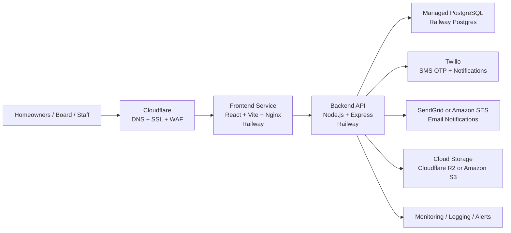

# Deans Pond HOA Portal
## Production Architecture Overview

This document summarizes the target production architecture for the Deans Pond HOA portal, identifies which components are already in strong shape, and highlights the remaining items needed before launching a pilot for community members.

## Solution Overview

The Deans Pond HOA portal is designed as a modern web application with separate frontend and backend services, backed by PostgreSQL, and integrated with cloud messaging and storage providers. The architecture supports homeowner mobile login, shared ticketing, surveys, events, staff administration, and community operations in a production-ready cloud deployment model.

## Target Production Components

| Layer | Component | Purpose | Status |
|---|---|---|---|
| Presentation | React + Vite frontend | User interface for homeowners, board, manager, and superadmin | Ready candidate |
| Web delivery | Nginx frontend container | Serves compiled frontend assets | Ready candidate |
| Application | Node.js / Express API | Business logic, auth, tickets, surveys, events, admin workflows | Ready candidate |
| Data | PostgreSQL | Stores users, tickets, surveys, events, sessions, audit logs | Ready candidate |
| Authentication | Mobile OTP + staff login | Homeowner SMS login and staff username/password access | Needs enhancement |
| Messaging | Twilio | SMS delivery for homeowner login codes | Needs procurement/config |
| Messaging | SendGrid / SES | Ticket and system email notifications | Needs procurement/config |
| Storage | R2 / S3 | Cloud file storage for documents, event assets, attachments | Needs procurement + implementation |
| Security edge | Cloudflare | DNS, SSL, WAF, and public routing | Needs procurement/config |
| Operations | Monitoring / alerts | Uptime, error tracking, and operational visibility | Needs enhancement |

## Current Strengths

The application already has a strong foundation for production:
- frontend and backend are separated cleanly
- PostgreSQL is already the system of record
- `DATABASE_URL` support is in place for cloud databases
- startup no longer relies on `sequelize.sync({ alter: true })`
- homeowner, board, manager, and superadmin roles are implemented
- ticketing, surveys, events, and session handling are already functioning
- the app is structurally aligned for separate Railway frontend and backend services

## Key Enhancements Still Required

Before publishing to production, the following items should be completed:
- replace the bootstrap migration with explicit schema migrations
- move uploads from local disk to cloud object storage
- add rate limiting to login and OTP endpoints
- tighten CORS and add security middleware such as `helmet`
- add production health checks and startup env validation
- configure real Twilio SMS delivery
- configure real email delivery through SendGrid or Amazon SES
- add monitoring, alerting, and backup validation
- test staging thoroughly before pilot release

## Recommended Hosting Pattern

The best production shape for this application is:
- `Frontend Service` on Railway
- `Backend Service` on Railway
- `Postgres` on Railway
- `Cloudflare` in front of both services
- `Twilio` for SMS-based homeowner OTP
- `SendGrid` or `Amazon SES` for outbound email
- `Cloudflare R2` or `Amazon S3` for uploaded files

## Recommended Public URLs

- `https://portal.deanspondcommunity.com`
- `https://api.deanspondcommunity.com`

## Production Readiness Summary

### Ready or Mostly Ready
- frontend web app
- backend API
- PostgreSQL usage
- role-based portal structure
- Railway-friendly service separation

### Needs Enhancement
- schema migration maturity
- upload storage architecture
- security hardening
- health checks and monitoring
- deployment automation

### Needs Procurement / Configuration
- Twilio
- SendGrid or Amazon SES
- Cloudflare
- R2 or S3
- production domains

## Conclusion

The Deans Pond HOA portal is in a strong pre-production state and can be evolved into a pilot-ready cloud application with a focused hardening phase. The recommended next step is to complete the remaining production engineering work around storage, security, messaging, and deployment operations, then launch to a small staging/UAT group before opening the pilot to homeowners.
